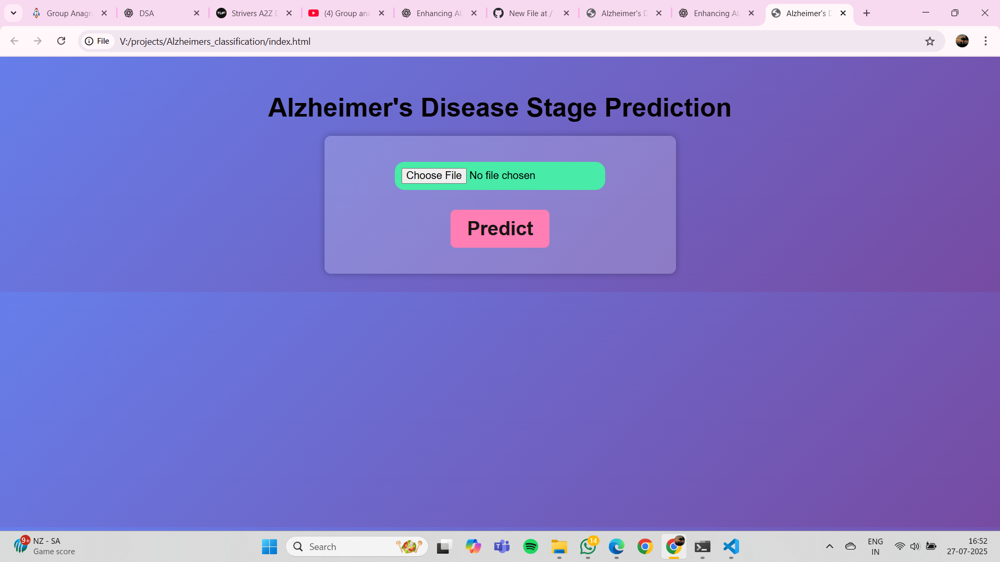
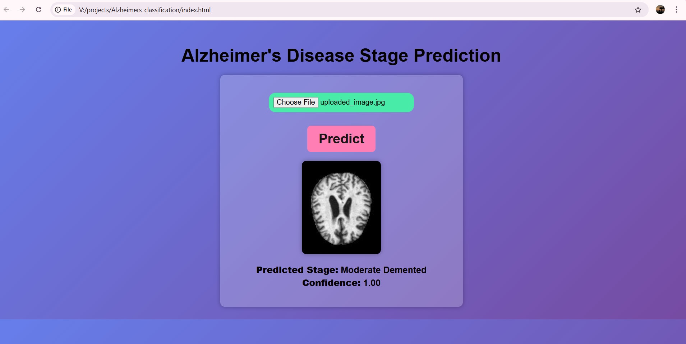

# Alzheimer's Stage Prediction (CNN Model)

This project uses a Convolutional Neural Network (CNN) to classify brain MRI images into four categories:
- **Non-Demented**
- **Very Mild Demented**
- **Mild Demented**
- **Moderate Demented**

## Dataset
- **Source:** [Augmented Alzheimer's Dataset (Kaggle)](https://www.kaggle.com/datasets)  
- Consists of MRI images labeled according to disease stage.

## Features
- Deep learning-based classification
- Data augmentation for improved accuracy
- Model saved in `.h5` format for deployment

## Tech Stack
- Python
- TensorFlow / Keras
- NumPy, Matplotlib
- Jupyter Notebook

## How to Run
1. Clone the repository:
   ```bash
   git clone https://github.com/<your-username>/alzheimers-stage-prediction.git
   cd alzheimers-stage-prediction
2. Strt the server using this command: **uvicorn app:app --reload --host 127.0.0.1 --port 8000**
3. Open the **index.html** file

## Model Results




